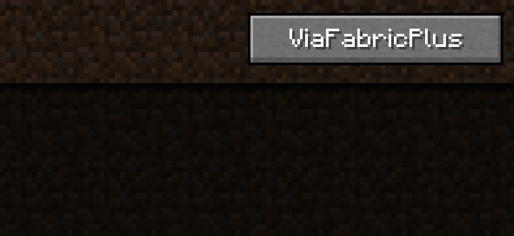
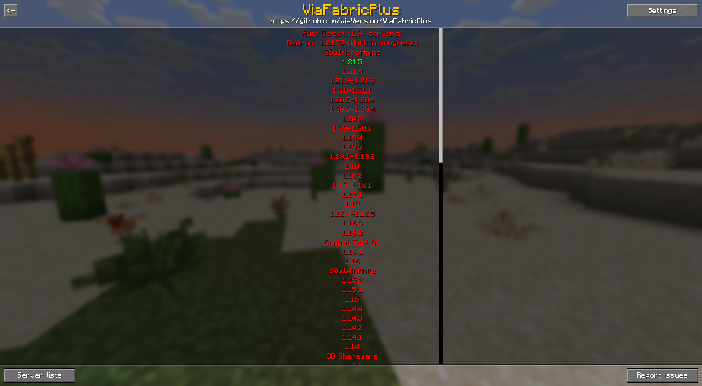
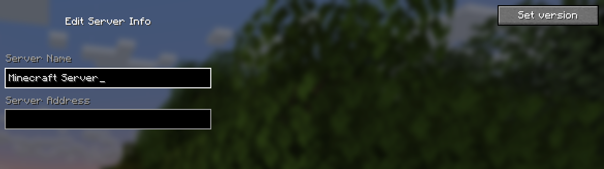
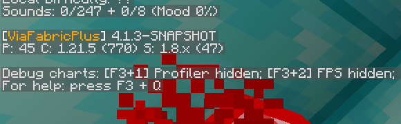
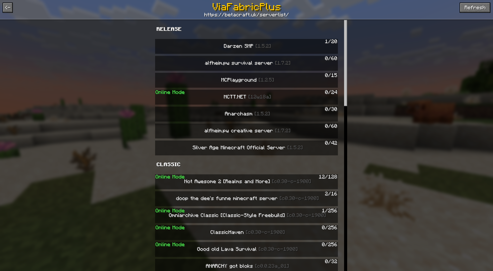
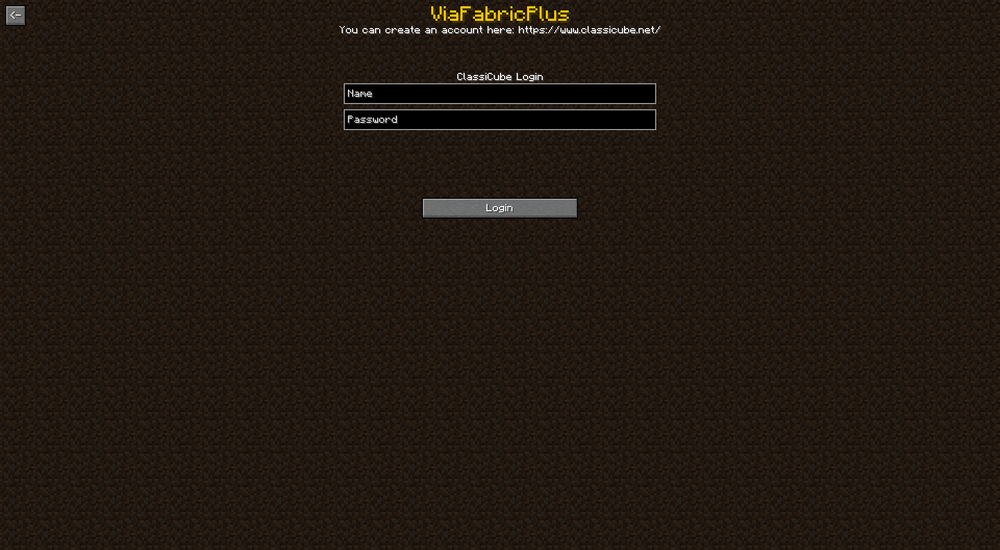

# Usage for ViaFabricPlus

## Introduction
At the top left of the multiplayer screen is the ViaFabricPlus button, with it you can enter the main menu of the mod 
where you can change the settings and set the protocol version, the position of the button can be changed in the
Settings -> General -> multiplayer screen button orientation.

In the Add/Edit Server screen there is a button where you can select a specific version for this server, when you ping or connect to this server, 
ViaFabricPlus will use the version set there, the versions are stored in the servers.dat too

If you don't want to specify a specific version anymore, you can simply press the button and select **"Cancel and reset"**.

## Commands
You can use the ViaVersion commands with **/viafabricplus** or **/viaversion**, and a few classic only commands are also implemented:
- **/viafabricplus settime <Time (Long)>** - Changes the Clientside World Time, available from: **c0.28-c0.30**
- **/viafabricplus listextensions** - Displays all classic protocol extensions, available in: **c0.30 CPE**

### Settings 
For users only the settings in the **General**, **Bedrock**, **Authentication** and **Visual** tab are relevant, the other settings are only for developers, you should not change the settings in the **Debug** tab if you don't know what you are doing.

The settings are stored in the `settings.json` file. Account credentials for Bedrock/ClassiCube in `accounts.json`.

### Configuring the protocol translation libraries
To change the protocol translation settings/features you can look into the config folder. You can find 4 config files there depending on the platforms loaded:

- `viaversion.yml` (ViaVersion)
- `viabackwards.yml` (ViaBackwards)
- `vialegacy.yml` (ViaLegacy)
- `viabedrock.yml` (ViaBedrock)
- `viaaprilfools.yml` (ViaAprilFools)

On it's first launch, ViaFabricPlus will generate the config files with proper default values. Don't touch the config files if you don't know what you are doing.

## Debug HUD
The debug HUD can be enabled in the settings, it shows some useful information about the connection and the protocol translation.

### Bedrock edition
Keep in mind that the Java -> Bedrock support is still in beta phase, and therefore many things are not implemented
yet and there is no guarantee that everything will work as it should.

To log in to a Bedrock account you can press the button **"Click to set account for Bedrock edition"** in the settings.

### ClassiCube and BetaCraft integration
In the main GUI there is an extra button for ClassiCube and BetaCraft, both buttons send API requests to the respective platforms to get the respective server list.
## BetaCraft

## ClassiCube

For ClassiCube you need an account, which you can make on the official website (https://www.classicube.net/), in case ClassiCube requires MultiFactor, an extra GUI will open in ViaFabricPlus.

