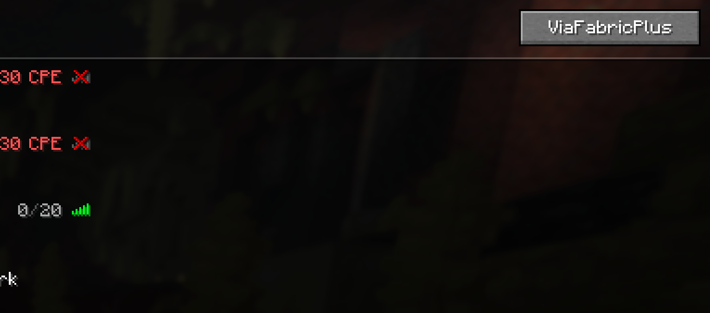
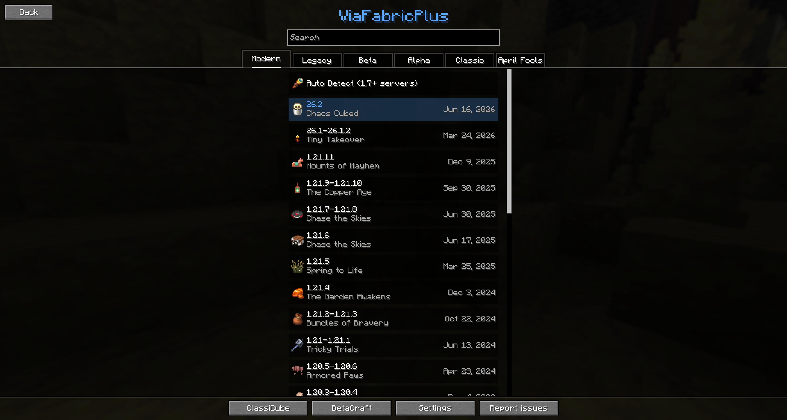
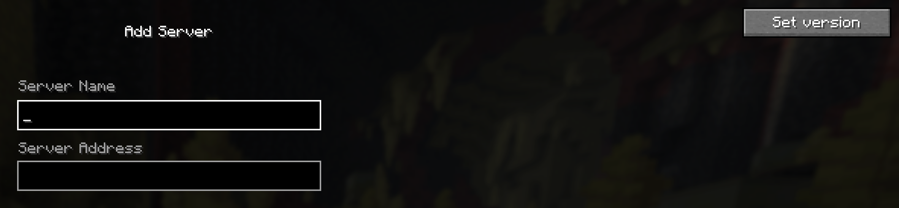
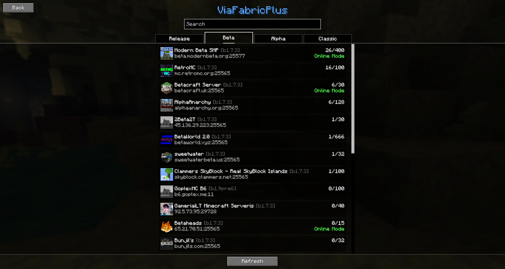
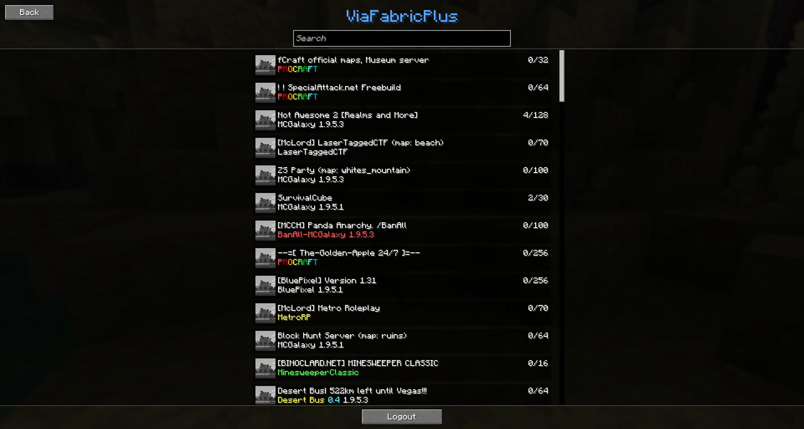
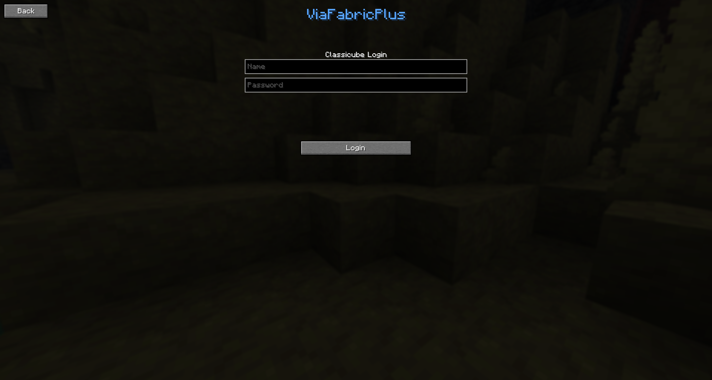
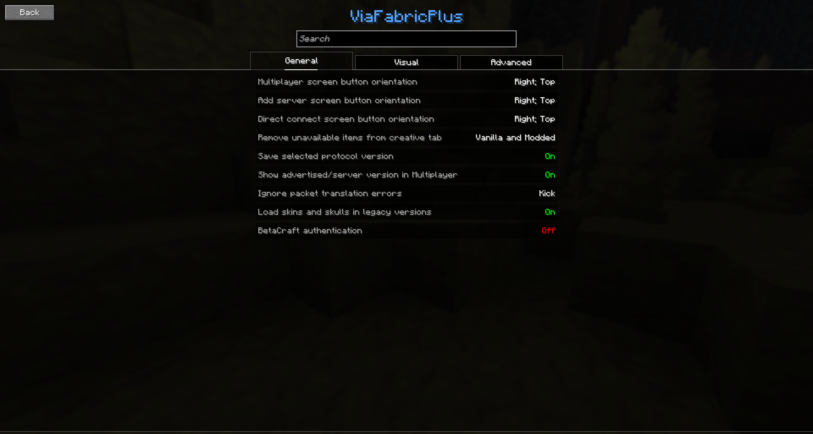
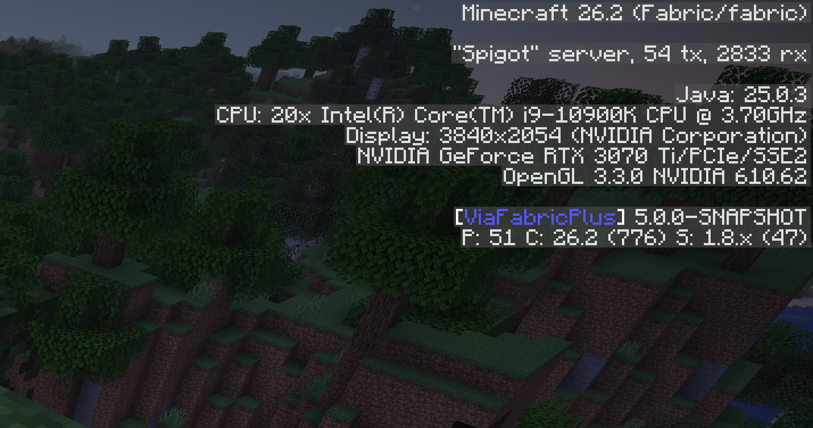

# Usage Guide

## Getting Started

When you open the **Multiplayer** screen, you'll notice a new **ViaFabricPlus button** in the top right corner. Clicking
it opens the mod's main menu, where you can pick the protocol version to play on, open the BetaCraft and ClassiCube
server lists, reach the settings and report issues.

You can move this button's position via **Settings → General → Multiplayer screen button orientation**.

### Choosing a Version

Versions are split into tabs by era, and the search bar at the top looks through all of them at once – by version name,
by update name, or by a version included in a range like `1.7.6-1.7.10`.

**Auto** at the top of the **Modern** tab doesn't pick a version itself. Instead, ViaFabricPlus detects the version of
the server you're joining and translates to that one.

Versions can only be changed while you're **not** connected to a server.

### Per-Server Version Selection

The **Set version** button on the **Add/Edit Server** screen picks a version just for that server. It's used for pinging
and joining and is saved in `servers.dat`, and **Reset** puts the server back on the globally selected version.

The **Direct Connect** screen has a button as well, but since there's no server entry to save the choice to, it opens
the main menu and changes the global version instead.

## Server Lists

Both lists are reachable from the main menu and are greyed out while you're connected to a server.

### BetaCraft

The list is split into tabs by era, hiding eras without online servers, and joining an entry automatically uses its game
version.

Servers marked as **Online Mode** verify your session on join. That needs **Settings → General → BetaCraft
authentication** to be enabled and a logged-in Minecraft account.

### ClassiCube

Joining ClassiCube servers needs a ClassiCube account (sign up at [classicube.net](https://www.classicube.net/)). If
multifactor authentication is enabled on it, ViaFabricPlus asks for the code sent to your email.

Your account is saved in `classicube.json`, so you only log in once – the session itself isn't stored, so the mod signs
in again in the background after a restart. **Logout** removes the saved account.

## Settings

Settings are split into **General**, **Visual** and **Advanced**, and the search bar finds a setting across all three.
Clicking an entry toggles it or cycles through its options, and changes take effect immediately.

Settings tied to a version range show it next to their name. Turning one on only has an effect while your target version
is inside that range.

⚠️ The **Advanced** tab is for developers – don't touch it unless you know what you're doing.

## Commands

ViaFabricPlus supports all normal **ViaVersion commands** under `/viafabricplus` or `/viaversion`. Additionally, it
adds:

- **/viafabricplus settings** – Opens the settings screen
- **/viafabricplus settime \<time\>** – Sets the client-side world time (**a1.0.16.2 and older**)
- **/viafabricplus listextensions** – Lists all Classic Protocol Extensions (**c0.30 CPE**)

## Config Files

All files live in the `config/viafabricplus` folder and are created with safe defaults on first launch.

- `settings.json` – everything from the settings screen, plus the selected protocol version
- `classicube.json` – your ClassiCube login info, only present while you're logged in
- `viaversion.yml`, `viabackwards.yml`, `vialegacy.yml`, `viaaprilfools.yml` – the protocol translation libraries. If
  you're not sure what a setting does, **don't change it**.

Any jar placed in the `jars` folder next to them overrides the bundled Via\* library of the same name.

## Debug HUD

ViaFabricPlus adds its own section to the vanilla **F3 debug screen**, showing the mod version and details about the
current connection.

