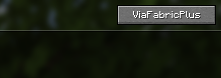
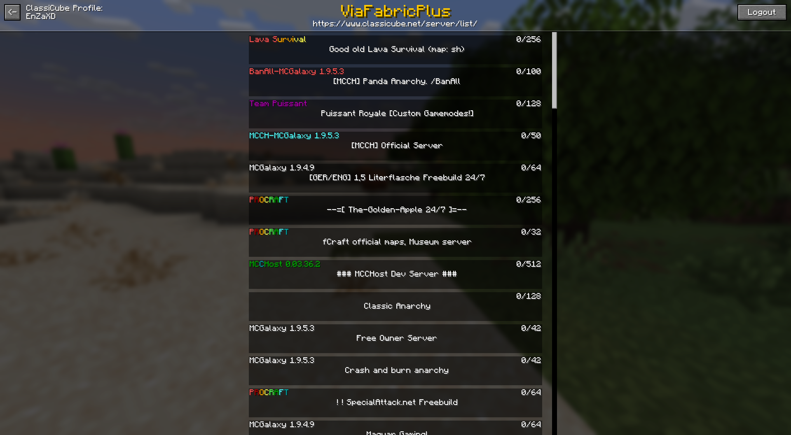

# Usage Guide

## Getting Started

When you open the **Multiplayer** screen, you’ll notice a new **ViaFabricPlus button** in the top right corner.
Clicking it opens the mod’s main menu, where you can:

- Adjust general settings
- Choose which protocol version to use

You can also move this button’s position via:
**Settings → General → Multiplayer screen button orientation**

### Per-Server Version Selection

On the **Add/Edit Server** screen, you’ll see a ViaFabricPlus button.
Here you can pick a specific version just for that server:

- When you **ping** or **join**, ViaFabricPlus will automatically use the chosen version.
- Your choice is saved in `servers.dat` (just like normal server info).

If you want to reset, simply press the button again and select **"Cancel and reset"**.

---

## Commands

ViaFabricPlus supports all normal **ViaVersion commands** under `/viafabricplus` or `/viaversion`.
Additionally, it adds some **classic-specific commands**:

- **/viafabricplus settime <time>** – Sets the client-side world time (available in **c0.28–c0.30**)
- **/viafabricplus listextensions** – Lists all Classic Protocol Extensions (**c0.30 CPE**)

---

## Settings

For most players, only these tabs matter:

- **General**
- **Bedrock**
- **Authentication**
- **Visual**

⚠️ The **Debug** tab is for developers only – don’t touch it unless you know what you’re doing.

Settings are saved in:

- `settings.json` (general settings)
- `accounts.json` (Bedrock/ClassiCube login info)

---

## Config Files

Advanced users can tweak the protocol translation libraries.
Configs are stored in the `config` folder and may include:

- `viaversion.yml` – core ViaVersion
- `viabackwards.yml` – backward compatibility
- `vialegacy.yml` – legacy versions
- `viabedrock.yml` – Bedrock support
- `viaaprilfools.yml` – April Fools versions

On first launch, all files are created with safe default values.
If you’re not sure what a setting does, **don’t change it**.

---

## Debug HUD

ViaFabricPlus includes a Debug HUD that can be toggled in settings.
It shows useful connection and protocol info while playing.

---

## Bedrock Edition Support

ViaFabricPlus also lets you connect to **Bedrock servers** – but keep in mind:

- Support is still **beta**
- Many features are incomplete or may not work correctly

To log into a Bedrock account:

- Go to Settings and click **“Click to set account for Bedrock edition”**

### Bedrock Realms

If you have a Bedrock account linked, you’ll see your **Bedrock Realms** listed in the **Server Lists** menu (bottom
left of the main GUI).

---

## ClassiCube & BetaCraft

ViaFabricPlus integrates with **ClassiCube** and **BetaCraft** server lists, accessible from the main GUI via the *
*Server Lists** button.

### BetaCraft

### ClassiCube

To join ClassiCube servers, you’ll need a ClassiCube account (sign up at [classicube.net](https://www.classicube.net/)).

- If MultiFactor authentication is required, ViaFabricPlus will open a dedicated login window.

